# Kona Pod - A Hyundai Kona EV Vehicle Monitor

> Vehicle Monitoring with Secure and Private Solid Pod Storage

[](https://flutter.dev)
[](https://dart.dev)

[](https://gjwgit.github.io/konapod)
[](https://github.com/gjwgit/konapod)
[](https://raw.githubusercontent.com/gjwgit/konapod/dev/LICENSE)
[](https://github.com/gjwgit/konapod/blob/dev/CHANGELOG.md)
[](https://github.com/gjwgit/konapod/commits/dev/)
[](https://github.com/gjwgit/rattle/commits/dev/)
[](https://github.com/gjwgit/konapod/issues)

[KonaPod](https://gjwgit.github.io/konapod/) monitors your Hyundai Kona EV:
live vehicle status from the Bluelink API, a logbook for recording charges and
drives, battery history charts, and driving efficiency statistics. All data is
stored encrypted in your own personal Data Vault on a Solid server in the
cloud, where everything stays within the Pod under your control. The app is
supported by [Togaware](https://togaware.com) and implemented by [Graham
Williams](https://togaware.com/Graham.Williams.html) pair coding with
[Claude Code](https://claude.com/product/claude-code) using
[Flutter](https://flutter.dev)'s [SolidUI](https://github.com/anusii/solidui)
package for cross platform development.

Solid Pods are a new approach to handling your personal data on the World Wide
Web and is the latest innovation from the inventor of the WWW, Sir Tim
Berners-Lee. Obtain a Pod for yourself on any Solid server and link it to your
app.

We make this project available for free so if you appreciate the app then
please show some ❤️ and tap on the star at
[GitHub](https://github.com/gjwgit/konapod) to support our work. See the [AU
Solid Community](https://solidcommunity.au) **showcase** for many more apps
using the Solid ecosystem.

The latest version of the app can be run online at
[konapod.solidcommunity.au](https://konapod.solidcommunity.au) with no
installation required though requiring a Bluelink login, or the app can be
downloaded and installed for your platform
from the [Solid Community AU](https://solidcommunity.au) repository:

<!-- markdownlint-disable MD036 -->
+ **Web**
  [solidcommunity](https://konapod.solidcommunity.au/);
+ **Android**
  [aab](https://solidcommunity.au/installers/konapod.aab) or
  [apk](https://solidcommunity.au/installers/konapod.apk);
+ **GNU/Linux**
  [deb](https://solidcommunity.au/installers/konapod_amd64.deb) or
  [snap](https://solidcommunity.au/installers/konapod_amd64.snap) or
  [zip](https://solidcommunity.au/installers/konapod-linux.zip);
+ **macOS**
  [dmg](https://solidcommunity.au/installers/konapod-macos.dmg) or
  [zip](https://solidcommunity.au/installers/konapod-macos.zip);
+ **Windows**
  [inno](https://solidcommunity.au/installers/konapod-windows-inno.exe) or
  [zip](https://solidcommunity.au/installers/konapod-windows.zip).

[Installation
details](https://github.com/gjwgit/konapod/blob/dev/installers/README.md)
are available for all platforms.

Contributions are welcome. Visit
[github](https://github.com/gjwgit/konapod) to submit an issue or, even
better, fork the repository yourself, update the code, and submit a Pull
Request. The app is implemented in [Flutter](https://flutter.dev) using
[solidui](https://pub.dev/packages/solidui). Thanks.

## Introduction

KonaPod is a desktop and mobile app for Hyundai and Kia EV owners (currently
for Australia / NZ but please send in PRs for other regions). It connects to
the Hyundai Bluelink API to fetch live vehicle status (battery charge, range,
odometer, climate, tyre pressures, door locks) and saves snapshots to your
Solid Pod so the data is always yours. A logbook lets you record every charge
and drive with start/end readings, charging details, and notes. Battery history
and driving efficiency charts are built from the accumulated log.

The Bluelink connection runs via a small Python helper script
(`bluelink_fetch.py`) that uses the open-source
[hyundai-kia-connect-api](https://github.com/Hyundai-Kia-Connect/hyundai_kia_connect_api)
library. The required setup takes about two minutes on a fresh install.

---

## Features

+ **Login** with your Bluelink email, password & PIN
+ **Auto login** on relaunch — no need to re-enter Bluelink credentials
+ **Demo mode** — test the UI without real credentials
+ **Dashboard** showing:
  + Vehicle nickname, model, year, colour & fuel type badge
  + Lock status, engine status, charging status
  + Battery level + range bar (EV/PHEV)
  + Fuel level + range bar (ICE/HEV)
  + Door, bonnet & boot open/close
  + Defrost status
  + Tyre pressure (all 4 corners, in kPa)
  + External temperature
  + Odometer reading
  + GPS coordinates
  + Full VIN & vehicle details
  + Last updated timestamp
+ **Pull-to-refresh** and refresh button
+ **Sign out**

---

## Quick start

1. **Install the Python library** — see [Bluelink setup](#bluelink-setup)
   below. This is required for live vehicle data.
2. **Log in to your Solid Pod** — tap the pod login button in the app bar and
   authenticate with your Pod provider.
3. **Enter Bluelink credentials** — go to **Settings** and enter your Hyundai
   Bluelink email, password, and PIN. Tap **Save Credentials**.
4. **Test the connection** — tap **Test Connection** in Settings. A step-by-step
   diagnostic shows exactly what's working and what needs attention.
5. **Fetch live data** — tap the cloud refresh button in the app bar to pull the
   latest vehicle status from Bluelink and save it to your Pod.

---

## Bluelink setup

The app delegates all Hyundai API calls to a Python script
(`bluelink_fetch.py`) that must be placed next to the app binary. The script
requires the `hyundai_kia_connect_api` Python library.

### 1. Install Python 3

Most Linux and macOS systems already have Python 3. Check with:

```bash
python3 --version
```

If it is missing on Ubuntu/Debian:

```bash
sudo apt install python3 python3-pip
```

### 2. Install hyundai-kia-connect-api

**Option A — simplest (recommended):**

```bash
pip install hyundai-kia-connect-api --break-system-packages
```

The `--break-system-packages` flag is required on Ubuntu 23.04+ because the
system pip blocks global installs by default. It is safe to use here — this
library has no effect on system tools.

**Option B — virtual environment:**

If you prefer to keep the library isolated:

```bash
python3 -m venv ~/.local/share/konapod/venv
~/.local/share/konapod/venv/bin/pip install hyundai-kia-connect-api
```

KonaPod will find and use this venv automatically — no further
configuration needed. The app searches the following locations in order:

```
~/.local/share/konapod/venv/bin/python
~/.konapod-venv/bin/python
<app binary dir>/venv/bin/python
python3   (system)
python    (system)
```

### 3. Place bluelink_fetch.py next to the app binary

The script ships alongside the installer. If it is missing, copy it from the
repository into the same directory as the `konapod` binary:

```bash
# Find where the binary lives:
which konapod

# Copy the script there (example):
cp bluelink_fetch.py /usr/local/bin/
```

### 4. Verify with Test Connection

Open **Settings → Test Connection**. The diagnostic dialog checks each
prerequisite in turn and shows a fix command if anything is missing.

### Keyring issues on a fresh Linux install

The app stores Bluelink credentials in the system keyring (`libsecret`). On a
fresh Ubuntu install the keyring may not be unlocked at startup, which
prevents credentials from being read and causes a `KeyringLocked` error.

Install and open Seahorse to create and unlock the default keyring:

```bash
sudo apt install seahorse
seahorse
```

In Seahorse: **File → New → Password Keyring** → name it `Login` → set a
blank password (or your login password). After that the keyring will unlock
automatically when you log in to the desktop.

---
## 🔌🚗 Showcase 🌳🌞

Under settings you can specify your username, password and pin to
access your Bluelink account. This is necessary to be able to use this
app. Currently only AU/NZ are supported but we welcome pull requests
to extend to other jurisdications.

Login Screen - Here you can connect to your historic data you have
stored securely and privately on your Solid Pod.

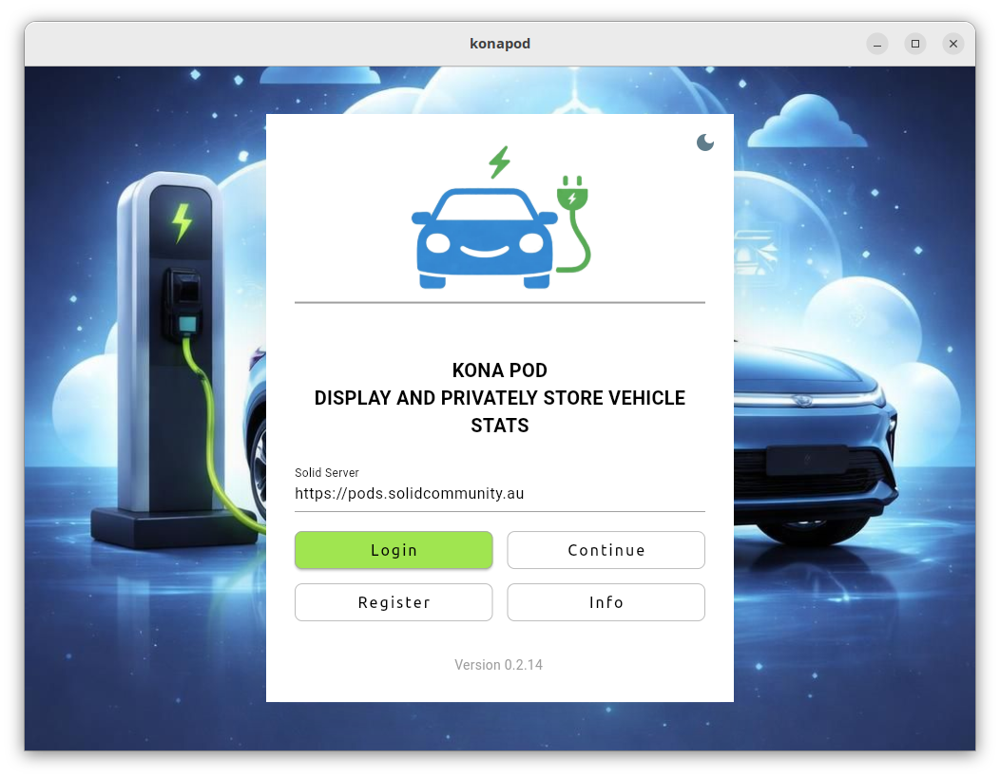

Changelog Screen - Tap the Version string to get the latest changes
for the app.

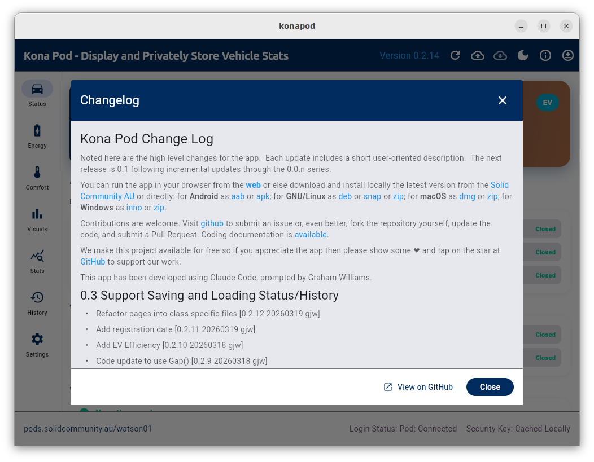

Status Page - The basic home page reports some of the key information
of interest to the driver.

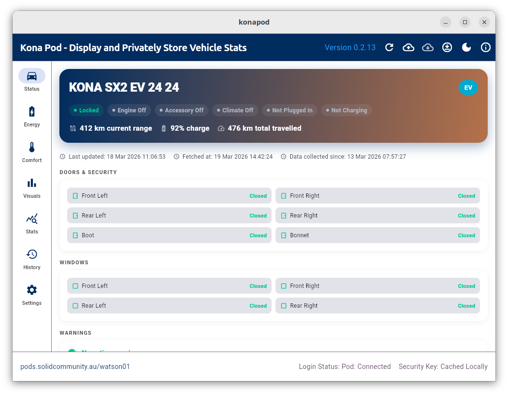

Status Page - Here we see some doors are open as well as the boot.

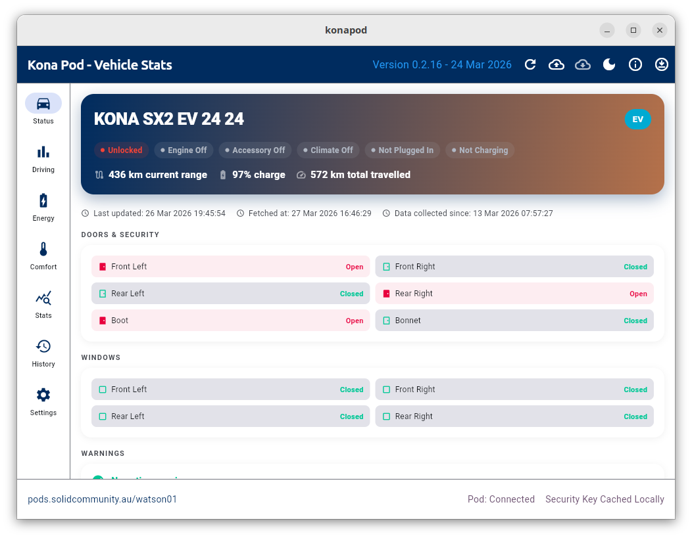

Here we see the car's engine is on.


It's useful to check if you've forgotten to lock your car.


Here the current tyre pressures are reported. This reading is only
available while the car is being driven.


Energy Page - The status of the battery and other energy related
statistics are presented here.

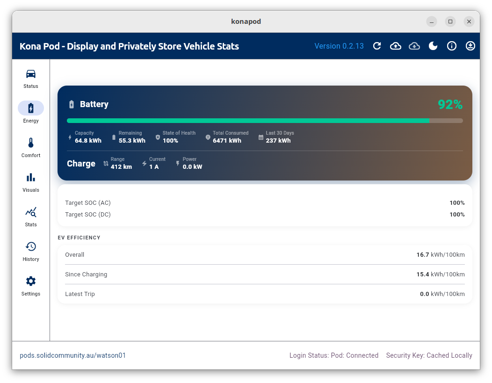

Energy Page while Charging - Here we see a charger is plugged in and
the vehicle is charging at 2.2kW (plugged into the normal home 240V
supply) with 9 hours and 40 minutes to go to 100%. Currently at 75%
charge and 333km range.

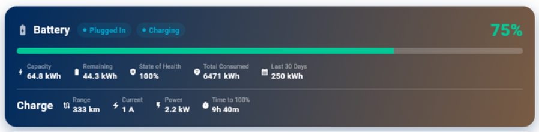

Energy Page Plugged In - The plugged status remains Plugged In and and
the Charging status disapers after charging has reached its set target
(100% here though recommended up to 80% day-to-day as set with the
`Target SOC`) and so the vehicle is no longer charging.

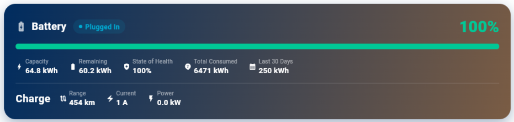

The Engergy Page also shows the reported battery percentage and km
range. I understand these are calculated estimates based on recent
charging levels.

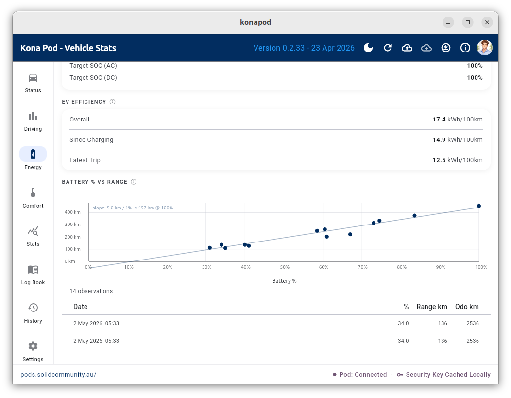

We can also plot the percentage against the remaining kWh to notice
the linear relationship, confirming that the percentage is simply the
percentage of battery charge, as expected. The kWh versus range
remaining is then the same plot as the percentage charge versus
distance or range remaining.

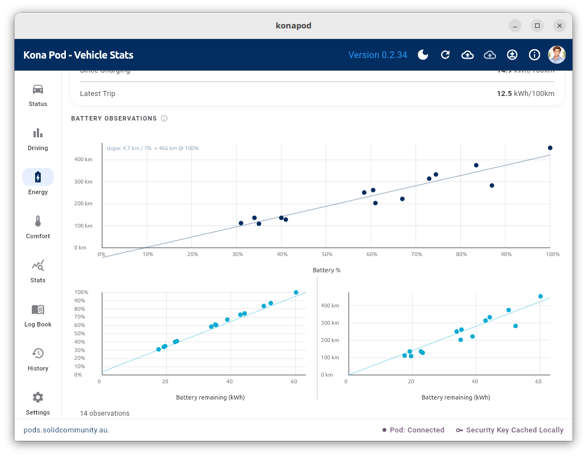

Visuals Page - Here we explore visually some of the vehicle performace
stats. The tooltip shows on this particular day the car regenerated
about half of the used power through braking, using iPedal that day.

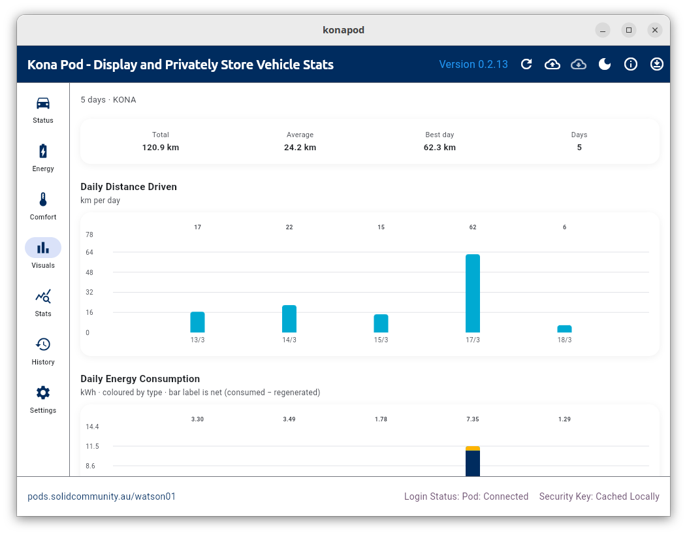

Stats Page - Various statistics about your vehicle's performance.

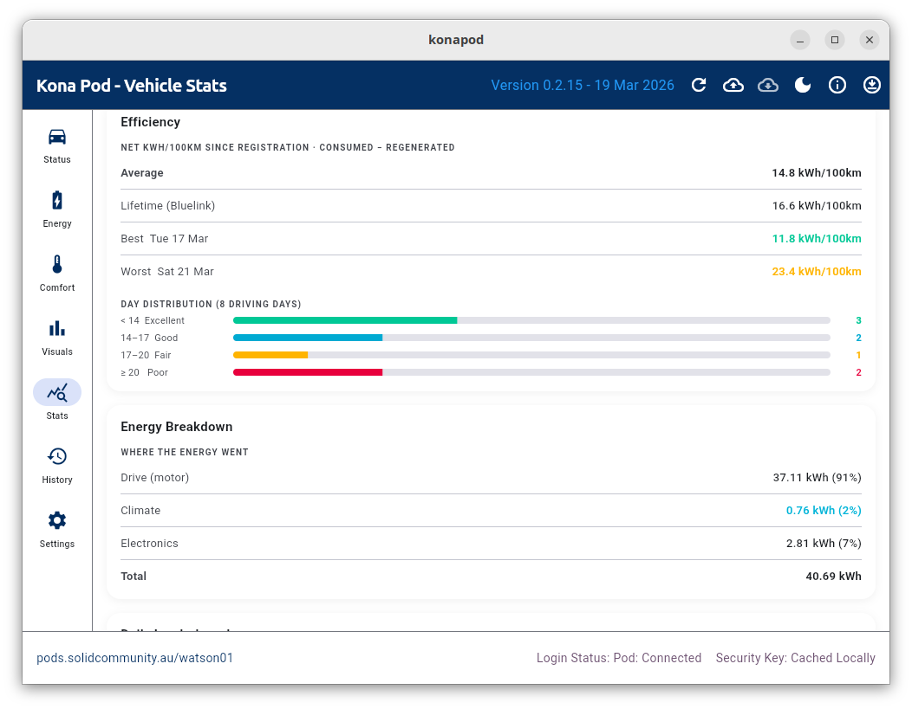

History Page - This data is stored securely and privately on your
Solid Pod. Tap the down arrow to load any dataset into the app as the
analysed/displayed dataset (replacing the data downloaded from your
vehicle).

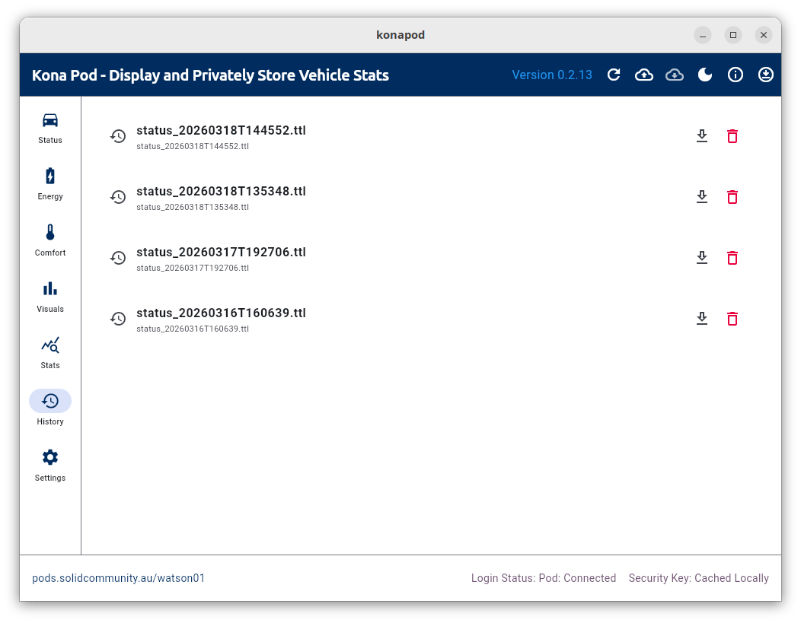

---

## Setup to Build for Yourself

### Prerequisites

+ Flutter 3.x+ installed
+ `flutter doctor` passing for your target platform

### Install

```bash
git clone git@github.com:gjwgit/konapod.git
cd konapod
flutter pub get
flutter run
```

---

## ⚠️ Important Notes

### Unofficial API

The Bluelink Australia API is **not officially published** by Hyundai.
This app uses endpoints reverse-engineered by the community:

+ [hyundai_kia_connect_api](https://github.com/Hyundai-Kia-Connect/hyundai_kia_connect_api)
+ [blog.kumo.dev — Reverse engineering Bluelink](https://blog.kumo.dev/2024/05/22/reverse_engineering_hkg_apps.html)

```bash
bluelink --region Australia --brand Hyundai \
         --username FOO --password BAR --pin 1234 \
         info --json infos.json
```

### Timezone Issue

Note that the API returns a "driving date" as a string like
"20260403", and the code uses `strptime()` to create a naive datetime
at midnight with no timezone info.  The Bluelink server aggregates
daily statistics by UTC day boundaries. So driving done before 11am
AEDT or 10am AEST (= midnight UTC) on April 4th, for example, gets
bucketed into April 3rd's stats, and the date label
says 20260403. This as a known Bluelink API limitation. The root cause
is server-side and not something the client library can fully fix.

## Stamp Mechanism

Hyundai's AU API requires a rotating "stamp" header.
This app fetches stamps from the community stamp server:
`https://raw.githubusercontent.com/neoPix/bluelinky-stamps/master/hyundai-{appId}.v2.json`

If the stamp server is unavailable, some API calls may fail.

## Rate Limits

Avoid refreshing too frequently — over-polling can drain your car's 12V battery.
The app uses **cached status** (latest known state) by default, which is safe.
Force-refresh directly queries the car's modem.

## Android Network Config

Add to `android/app/src/main/AndroidManifest.xml` inside `<application>`:

```xml
android:usesCleartextTraffic="true"
android:networkSecurityConfig="@xml/network_security_config"
```

And create `android/app/src/main/res/xml/network_security_config.xml`:

```xml
<?xml version="1.0" encoding="utf-8"?>
<network-security-config>
    <domain-config cleartextTrafficPermitted="true">
        <domain includeSubdomains="true">au-apigw.ccs.hyundai.com.au</domain>
    </domain-config>
</network-security-config>
```

## iOS

Add to `ios/Runner/Info.plist`:

```xml
<key>NSAppTransportSecurity</key>
<dict>
    <key>NSAllowsArbitraryLoads</key>
    <true/>
</dict>
```

## The six screens

A left-hand navigation rail gives you:

### Status

Live vehicle status fetched from Bluelink: battery percentage and estimated
range, climate state, door and window locks, tyre pressures, and the last
update time. Tap the cloud button in the app bar to refresh.

### Driving

Driving efficiency statistics calculated from the logbook: consumption
(kWh/100 km), average speed, and trip breakdowns.

### Battery

Battery history chart built from accumulated logbook readings. Shows state of
charge over time and highlights charge events.

### Comfort

Climate, seat heating/cooling, and other comfort-related readings from the
last Bluelink snapshot.

### Log Book

The main record of every charge and drive. Each entry captures start and end
vehicle readings (odometer, battery %, remaining kWh, EV range) plus charging
details (vendor, energy delivered, charge rate, duration, cost). Tap an entry
to expand its details, or tap the edit icon to modify it.

### Settings

Enter and save Bluelink credentials, run the connection diagnostic, and view
setup instructions.

---

## Adding and editing a log entry

Tap **+** in the Log Book screen to add a new entry. The edit form captures:

+ **Title** — e.g. "Home charge", "NRMA fast charge", "Drive to Sydney"
+ **Date and time** — defaults to now
+ **Location** — optional address with geocode
+ **Start readings** — odometer (km), battery (%), remaining (kWh), EV range (km)
+ **Charging session toggle** — turn on to reveal charging detail fields
+ **End readings** — same fields as start, plus a "From Bluelink" button that
  fills in the latest values from the last API fetch
+ **Charging details** — vendor/network, energy delivered (kWh), charge rate
  (kW), duration (h and m), cost per kWh, total cost
+ **Notes** — free text for anything else

Tap any existing entry to edit it. Drag the right handle to reorder entries.
Swipe left to delete (with confirmation).

---

## About info

Tap the **info** (ℹ) button in the top app bar at any time to see a brief
about-the-app dialog with the version number and links to the repository.

---

## Data and privacy

All vehicle snapshots and logbook entries are stored in your Solid Pod under
the `konapod/` directory as Turtle (`.ttl`) and JSON files. Nothing about
your vehicle or driving ever leaves your Pod unless you explicitly export it.

Your Bluelink credentials (email, password, PIN) are stored only in the
system keyring on your local device — they are never sent to the Pod or to
any server other than the Hyundai Bluelink API during a live fetch.

---

## Troubleshooting

**Test Connection shows "Python + hyundai_kia_connect_api not found".**
Install the library: `pip install hyundai-kia-connect-api --break-system-packages`
or set up a venv at `~/.local/share/konapod/venv` — see
[Bluelink setup](#bluelink-setup).

**Test Connection shows "bluelink_fetch.py not found".**
The script must sit next to the app binary. Copy it from the repository to the
path shown in the error message.

**KeyringLocked error on startup.**
The system keyring is not unlocked. Install Seahorse and unlock the default
keyring — see [Keyring issues](#keyring-issues-on-a-fresh-linux-install).
The app will continue to load; enter credentials manually in Settings.

**"Timed out after 90s" from Bluelink.**
The Hyundai API is slow or temporarily unavailable. Try again after a few
minutes. If it consistently times out, check that your Bluelink account is
active in the Hyundai app on your phone.

**No data on the Status screen after a successful fetch.**
Make sure you are logged in to your Solid Pod (status bar at the bottom shows
"Logged In") and that the security key is cached. Tap the key indicator if it
shows as missing.

---

## License

GNU General Public License v3. See `LICENSE` or
<https://opensource.org/license/gpl-3-0>.

Copyright (C) 2026, Togaware Pty Ltd.
